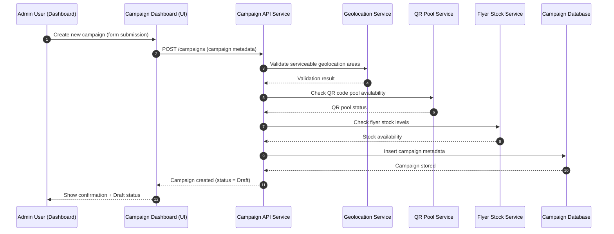
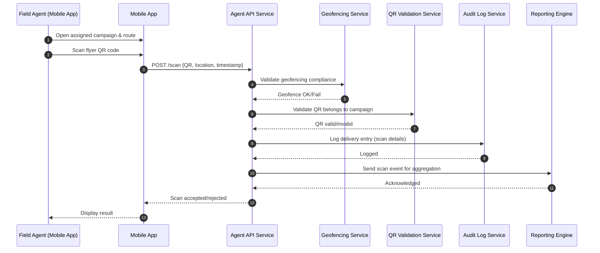

# **Part 1 – System Journeys and Architecture**

# System Journeys & Architecture Diagrams

This repository contains the system integration diagrams for two core Oppizi workflows:

1. **Campaign Creation Flow**  
2. **Agent Flyer Scan Flow**  


Each diagram is provided in **two formats**:

- **PNG** (for visual preview)
- **Mermaid `.mmd` source files** (for editing or regenerating PNGs)

These diagrams are intended for **system integration testing**, QA documentation, and architectural understanding.


# **Repository Structure**

```
/diagrams
   ├── campaign_creation.mmd
   ├── agent_flyer_scan.mmd
   ├── campaign_creation.png
   └──  agent_flyer_scan.png
   

README.md
```

---

# **System Diagrams (PNG Preview)**

Below are the PNG diagrams.  
Make sure the PNG files are placed inside the `/diagrams` folder.

---

## 1️⃣ **Campaign Creation– Sequence Diagram**

`[Parece que el resultado no era seguro para mostrar. ¡Cambiemos de enfoque y probemos algo diferente!]`

---

## 2️⃣ **Agent Flyer Scan – Sequence Diagram**

`[Parece que el resultado no era seguro para mostrar. ¡Cambiemos de enfoque y probemos algo diferente!]`

---

## 3️⃣ **Architecture Overview – Component Interaction Diagram**

`[Parece que el resultado no era seguro para mostrar. ¡Cambiemos de enfoque y probemos algo diferente!]`

---

# 🧩 **Mermaid Source Code (Editable)**

Below is the Mermaid code for each diagram.  
You can edit it directly or regenerate PNGs using Mermaid Live Editor or Mermaid CLI.

---

## 📄 **campaign_creation.mmd**



---

## 📄 **agent_flyer_scan.mmd**



---


# **How to Regenerate PNG Files**

You can regenerate PNGs from the `.mmd` files using any of the following methods.


## **Mermaid Live Editor**

1. Open: [https://mermaid.live](https://mermaid.live)  
2. Paste the `.mmd` content  
3. Click **Export → PNG**  
4. Save into `/diagrams`

---

# 🎯 **Purpose of These Diagrams**

These diagrams support:

- System integration testing  
- QA documentation  
- Architecture reviews  
- Developer onboarding  
- Technical assignments  

They highlight:

- API interactions  
- Microservice dependencies  
- Data validation flows  
- Logging and reporting integrations  

---


## **Contact**

If you need something else or you have any doubts, please feel free to [contact me:](mailto:mmungarro@gmail.com)
